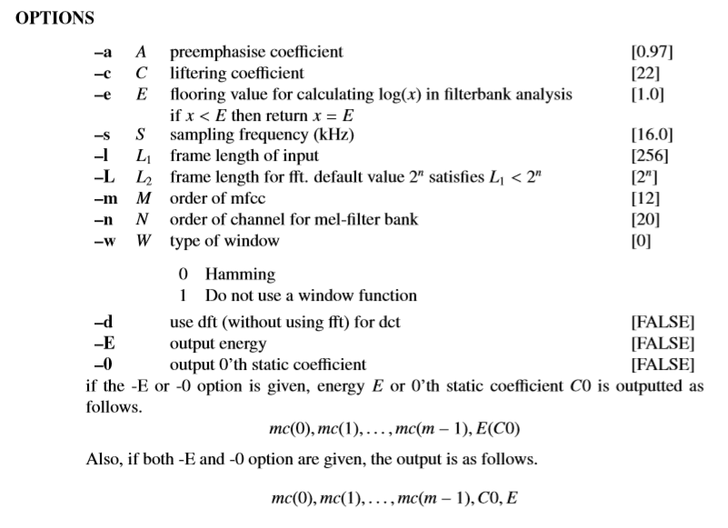
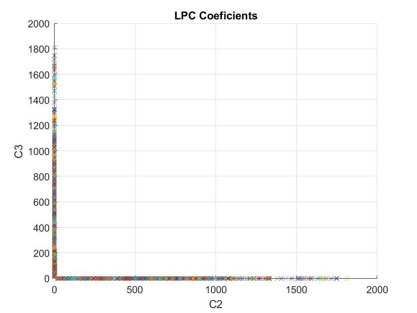
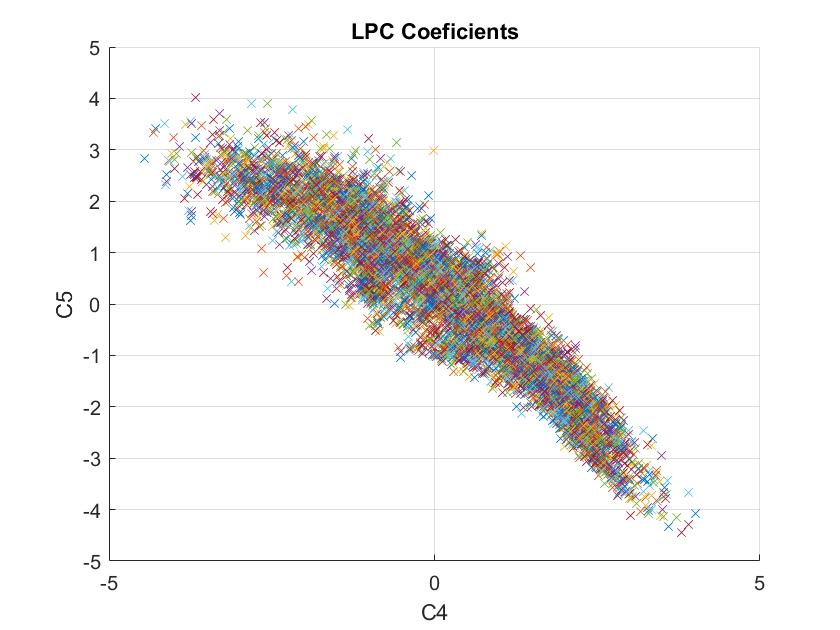
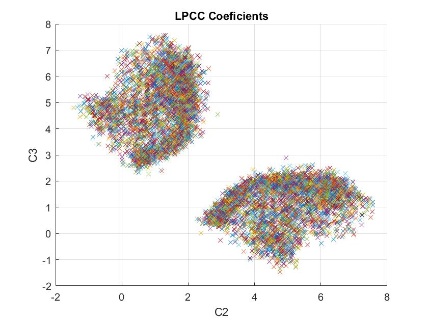
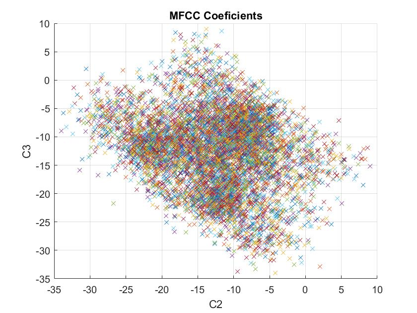

PAV - P4: reconocimiento y verificación del locutor
===================================================

Obtenga su copia del repositorio de la práctica accediendo a [Práctica 4](https://github.com/albino-pav/P4)
y pulsando sobre el botón `Fork` situado en la esquina superior derecha. A continuación, siga las
instrucciones de la [Práctica 2](https://github.com/albino-pav/P2) para crear una rama con el apellido de
los integrantes del grupo de prácticas, dar de alta al resto de integrantes como colaboradores del proyecto
y crear la copias locales del repositorio.

También debe descomprimir, en el directorio `PAV/P4`, el fichero [db_8mu.tgz](https://atenea.upc.edu/pluginfile.php/3145524/mod_assign/introattachment/0/spk_8mu.tgz?forcedownload=1)
con la base de datos oral que se utilizará en la parte experimental de la práctica.

Como entrega deberá realizar un *pull request* con el contenido de su copia del repositorio. Recuerde
que los ficheros entregados deberán estar en condiciones de ser ejecutados con sólo ejecutar:

~~~~~~~~~~~~~~~~~~~~~~~~~~~~~~~~~~~~~~~~~~~~~~~~~~~~~.sh
  make release
  run_spkid mfcc train test classerr verify verifyerr
~~~~~~~~~~~~~~~~~~~~~~~~~~~~~~~~~~~~~~~~~~~~~~~~~~~~~

Recuerde que, además de los trabajos indicados en esta parte básica, también deberá realizar un proyecto
de ampliación, del cual deberá subir una memoria explicativa a Atenea y los ficheros correspondientes al
repositorio de la práctica.

A modo de memoria de la parte básica, complete, en este mismo documento y usando el formato *markdown*, los
ejercicios indicados.

## Ejercicios.

### SPTK, Sox y los scripts de extracción de características.

- Analice el script `wav2lp.sh` y explique la misión de los distintos comandos, y sus opciones, involucrados
  en el *pipeline* principal (`sox`, `$X2X`, `$FRAME`, `$WINDOW` y `$LPC`).

~~~~~~~~~~~~~~~~~~~~~~~~~~~~~~~~~~~~~~~~~~~~~~~~~~~~~.sh
- SOX: Serveix per a canviar el format de la senyal d'entrada i generar una senyal de sortida
amb un format que s'adeqüi als nostres requeriments. En aquest cas, el configurem amb les comandes:
	-t raw: Indiquem que volem un senyal de sortida amb format raw
	-e signed: Indiquem el tipus de codificació de la senyal de sortida
	-b 16: Mida en bits de les mostres de sortida
Executant sox o sox -h podem veure totes les opcions que ofereix.
En el nostre cas hem convertit un fitxer WAVE a format raw, per a que el pugui llegir
el programa X2X.

- $X2X: Programa sptk que permet fer conversions de format de dades entre fitxers, de la forma:
		x2x [ +type1][ +type2][–r][–o][%format ]
	En el nostre cas, fent x2x +sf estem indicant que el converteixi a SHORT FORMAT

- $FRAME:Programa sptk que permet extreure frames d'una sequencia de dates, amb les opcions:
		frame [–l L ][–p P ][–n][infile]
	Sent:
		-l: Frame Length
		-p: Frame Period
	Indiquem aquests parametres en mostres, respecte de la nostra Sampling Frequency de 8kHz

- $WINDOW:Programa sptk que permet aplicar una finestra a una sequencia de dades o frame, de la forma:
		window [–l L1 ][–L L2][–n N ][–w W ][infile]
		
	Sent:
		-l: Mida de l'input frame
		-L: Mida de l'output frame
		-W: Tipus de finestra

	En el nostre cas utilitzarem la finestra que ve per defecte, la de Blackman, ja que ens ha 
	proporcionat els millors resultats

- $LPC: Programa sptk que permet fer l'anàlisi LPC d'un input frame, de la forma:
		lpc [–l L ][–m M ][–f F ][infile]
	
	Sent:
		-l: Input Frame Length
		-m: Lpc Order

~~~~~~~~~~~~~~~~~~~~~~~~~~~~~~~~~~~~~~~~~~~~~~~~~~~~~

- Explique el procedimiento seguido para obtener un fichero de formato *fmatrix* a partir de los ficheros
  de salida de SPTK (líneas 41 a 47 del script `wav2lp.sh`).

```cpp
# Main command for feature extration
sox $inputfile -t raw -e signed -b 16 - | $X2X +sf | $FRAME -l 240 -p 80 | $WINDOW -l 240 -L 240 |
	$LPC -l 240 -m $lpc_order > $base.lp

# Our array files need a header with the number of cols and rows:
ncol=$((lpc_order+1)) # lpc p =>  (gain a1 a2 ... ap) 
nrow=`$X2X +fa < $base.lp | wc -l | perl -ne 'print $_/'$ncol', "\n";'`

# Build fmatrix file by placing nrow and ncol in front, and the data after them
echo $nrow $ncol | $X2X +aI > $outputfile
cat $base.lp >> $outputfile
```
~~~~~~~~~~~~~~~~~~~~~~~~~~~~~~~~~~~~~~~~~~~~~~~~~~~~~.sh
Primerament executem totes les comandes necessaries per a generar el fitxer $base.lp, que incloura els coeficients
LPC calculats.

Seguidament, tindrem en aquest fitxer, una columna per a cada coeficient, més una columna extra on 
indiquem el guany utilitzat en el factor de guany del predictor lineal. D'altra banda, indiquem que 
volem tantes files com trames de la senyal haguem generat, i guardarem el valor dels coeficients com 
en format float ASCII (+fa). Per a calcular el nºfiles s'utilitza la comanda wc -l.

Finalment constrium la matriu guardant-la en l'outputfile.
~~~~~~~~~~~~~~~~~~~~~~~~~~~~~~~~~~~~~~~~~~~~~~~~~~~~~

  * ¿Por qué es conveniente usar este formato (u otro parecido)?

~~~~~~~~~~~~~~~~~~~~~~~~~~~~~~~~~~~~~~~~~~~~~~~~~~~~~.sh
Considerem que és un format que ofereix molts avantatges a l'hora de treballar. Primer perquè ens 
permet estructurar de manera molt clara els coeficients o features calculats, separant-los per 
cada trama. Així doncs, facilita molt l'análisi dels coeficients obtinguts, permetent, per exemple,
generar qualsevol tipus de gràfic (Matlab, Python) sense gaires esforços.
	
~~~~~~~~~~~~~~~~~~~~~~~~~~~~~~~~~~~~~~~~~~~~~~~~~~~~~

- Escriba el *pipeline* principal usado para calcular los coeficientes cepstrales de predicción lineal
  (LPCC) en su fichero <code>scripts/wav2lpcc.sh</code>:

```cpp
sox $inputfile -t raw -e signed -b 16 - | $X2X +sf | $FRAME -l 184 -p 104 | $WINDOW -l 184 |
	$LPC -l 184 -m $lpc_order | $LPC2C -m $lpc_order -M $lpcc_order> $base.lpcc
```

- Escriba el *pipeline* principal usado para calcular los coeficientes cepstrales en escala Mel (MFCC) en
  su fichero <code>scripts/wav2mfcc.sh</code>:

```cpp
sox $inputfile -t raw -e signed -b 16 - | $X2X +sf | $FRAME -l 184 -p 104| $WINDOW -l 184 |
	$MFCC -l 184 -m $mfcc_order > $base.mfcc
```
~~~~~~~~~~~~~~~~~~~~~~~~~~~~~~~~~~~~~~~~~~~~~~~~~~~~~.sh

Per tal d'obtenir els millors resultats possibles, hem optimtizat tots els paràmetres que 
ofereix la funció sptk mfcc

~~~~~~~~~~~~~~~~~~~~~~~~~~~~~~~~~~~~~~~~~~~~~~~~~~~~~



~~~~~~~~~~~~~~~~~~~~~~~~~~~~~~~~~~~~~~~~~~~~~~~~~~~~~.sh

Hem variat:
	- Frame Length en un llindar de 15-35ms
	- Frame Overlap (funció sptk Window) en un llindar de 5-15ms
	- Filtre Aplicat (Blackman, Hamming)
	- NºFiltres: Segons la teoria, el nºideal està entre 24 i 40, 
		 	però en el nostre cas hem obtingut el resultat
			més òptim utilitzant només un bank de 20 filtres
	- NºCoeficients: Entre 12 i 16. Resultat òptim amb 13 coeficients		

~~~~~~~~~~~~~~~~~~~~~~~~~~~~~~~~~~~~~~~~~~~~~~~~~~~~~

### Extracción de características.

- Inserte una imagen mostrando la dependencia entre los coeficientes 2 y 3 de las tres parametrizaciones
  para una señal de prueba.
  
 `Codi MATLAB:`

```matlab

close all;

%  Obrim els fitxers
fileLPC = fopen('lp_2_3.txt', 'r');
fileLPCC = fopen('lpcc_2_3.txt', 'r');
fileMFCC = fopen('mfcc_2_3.txt', 'r');

%  Obtenim els coeficients
coefLPC = fscanf(fileLPC, '%f');
coefLPCC = fscanf(fileLPCC, '%f');
coefMFCC = fscanf(fileMFCC, '%f');

%  Tanquem els fitxers
fclose(fileLPC);
fclose(fileLPCC);
fclose(fileMFCC);

%%%%%%%%%% CONFIGURACIÓ DE LES GRÀFIQUES %%%%%%%%%%%

figure;
xlabel('C2');
ylabel('C3');
grid on;
title('LPCC Coeficients')
hold on;
for i=1:(size(coefLPCC,1)-1)
    plot(coefLPCC(i), coefLPCC(i+1), 'x');
end
hold off;

figure;
xlabel('C2');
ylabel('C3');
grid on;
title('MFCC Coeficients')
hold on;
for i=1:(size(coefMFCC,1)-1)
    plot(coefMFCC(i), coefMFCC(i+1), 'x');
end
hold off;


figure;
xlabel('C2');
ylabel('C3');
grid on;
title('LPC Coeficients')
hold on;
for i=1:(size(coefLPC,1)-1)
    plot(coefLPC(i), coefLPC(i+1), 'x');
end
hold off;
```






~~~~~~~~~~~~~~~~~~~~~~~~~~~~~~~~~~~~~~~~~~~~~~~~~~~~~.sh
Observem que en el cas de les correlacions LP dels coeficients 2 i 3, obtenim una
gràfica una mica peculiar, fet que no passa si comparem els coeficients 4 i 5
~~~~~~~~~~~~~~~~~~~~~~~~~~~~~~~~~~~~~~~~~~~~~~~~~~~~~

  + ¿Cuál de ellas le parece que contiene más información?

- Usando el programa <code>pearson</code>, obtenga los coeficientes de correlación normalizada entre los
  parámetros 2 y 3, y rellene la tabla siguiente con los valores obtenidos.

~~~~~~~~~~~~~~~~~~~~~~~~~~~~~~~~~~~~~~~~~~~~~~~~~~~~~.sh
Executem, per exemple:

pearson work/lp/BLOCK00/SES000/SA000S*.lp
pearson work/lpcc/BLOCK00/SES000/SA000S*.lpcc
pearson work/mfcc/BLOCK00/SES000/SA000S*.mfcc
~~~~~~~~~~~~~~~~~~~~~~~~~~~~~~~~~~~~~~~~~~~~~~~~~~~~~

  |                        | LP   | LPCC | MFCC |
  |------------------------|:----:|:----:|:----:|
  | &rho;<sub>x</sub>[2,3] |-0.809|0.215 | 0.03 |
  
  + Compare los resultados de <code>pearson</code> con los obtenidos gráficamente.

Abans de tot, consultem que volen dir els resultats proporcionats pel programa pearson, i observem que proporciona
un valor que serveix per a medir la correlació entre els coeficients, de la manera següent:

  

~~~~~~~~~~~~~~~~~~~~~~~~~~~~~~~~~~~~~~~~~~~~~~~~~~~~~.sh
Per tant, observem que els resultats de les gràfiques de matlab concorden amb els que ens proporciona el programa pearson:
	- LPC: En la gràfica dels coeficients 4 i 5, observem que estan força alineats, formant una gràfica de pendent negatiu,
		per tant, té sentit obtenir valors que estiguin al voltant del -0.8
	- LPCC: Observem una gràfica formada per dues agrupacions, sense gaire correlació, per tant, te sentit obtenir un valor 
		molt inferior al del LPC, de 0.215
	- MFCC: Observem que els valors no estan gens correlats, per tant, concorda amb el valor de 0.03 que ens proporciona pearson.
~~~~~~~~~~~~~~~~~~~~~~~~~~~~~~~~~~~~~~~~~~~~~~~~~~~~~

- Según la teoría, ¿qué parámetros considera adecuados para el cálculo de los coeficientes LPCC y MFCC?

### Entrenamiento y visualización de los GMM.

Complete el código necesario para entrenar modelos GMM.

- Inserte una gráfica que muestre la función de densidad de probabilidad modelada por el GMM de un locutor
  para sus dos primeros coeficientes de MFCC.
  
- Inserte una gráfica que permita comparar los modelos y poblaciones de dos locutores distintos (la gŕafica
  de la página 20 del enunciado puede servirle de referencia del resultado deseado). Analice la capacidad
  del modelado GMM para diferenciar las señales de uno y otro.

### Reconocimiento del locutor.

Complete el código necesario para realizar reconociminto del locutor y optimice sus parámetros.

- Inserte una tabla con la tasa de error obtenida en el reconocimiento de los locutores de la base de datos
  SPEECON usando su mejor sistema de reconocimiento para los parámetros LP, LPCC y MFCC.

### Verificación del locutor.

Complete el código necesario para realizar verificación del locutor y optimice sus parámetros.

- Inserte una tabla con el *score* obtenido con su mejor sistema de verificación del locutor en la tarea
  de verificación de SPEECON. La tabla debe incluir el umbral óptimo, el número de falsas alarmas y de
  pérdidas, y el score obtenido usando la parametrización que mejor resultado le hubiera dado en la tarea
  de reconocimiento.
 
### Test final y trabajo de ampliación.

- Recuerde adjuntar los ficheros `class_test.log` y `verif_test.log` correspondientes a la evaluación
  *ciega* final.

- Recuerde, también, enviar a Atenea un fichero en formato zip o tgz con la memoria con el trabajo
  realizado como ampliación, así como los ficheros `class_ampl.log` y/o `verif_ampl.log`, obtenidos como
  resultado del mismo.
